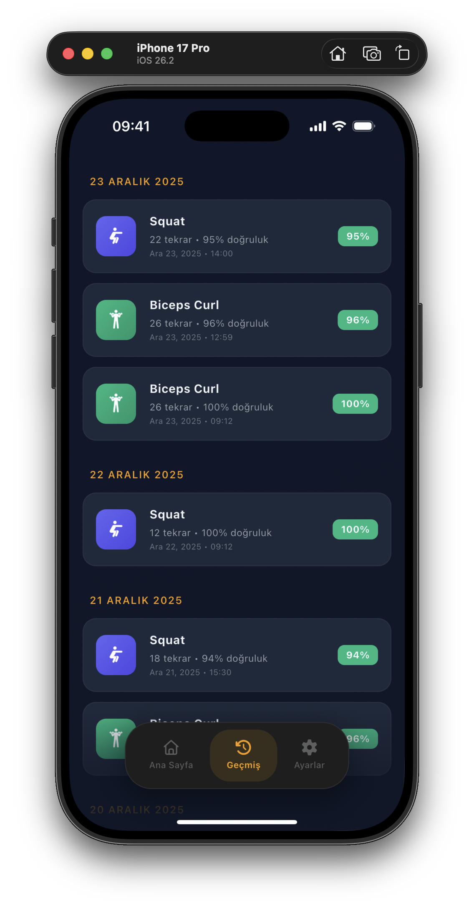
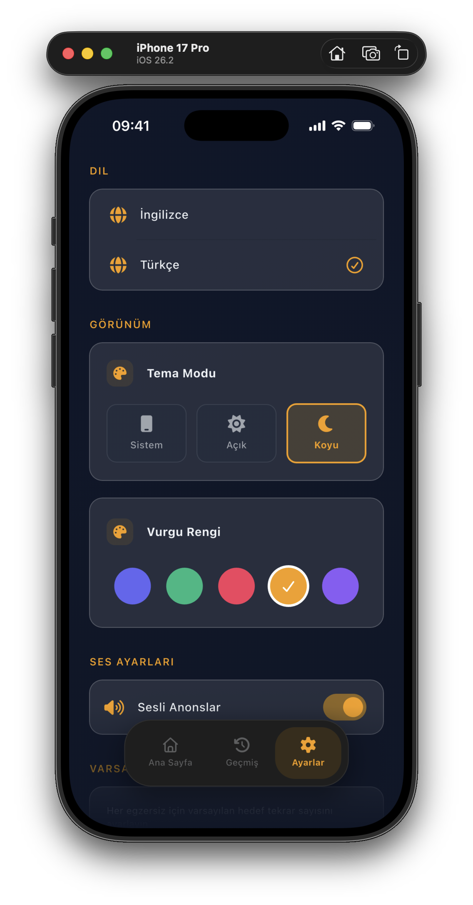
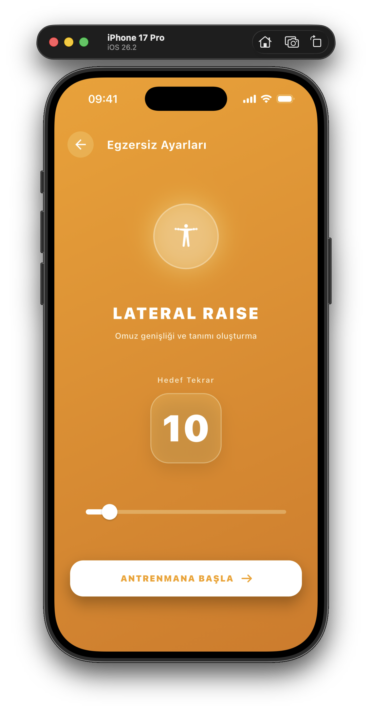
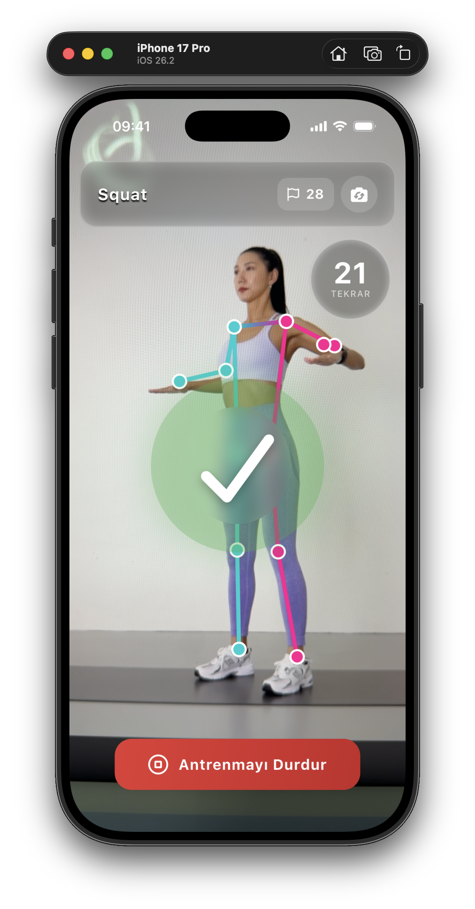
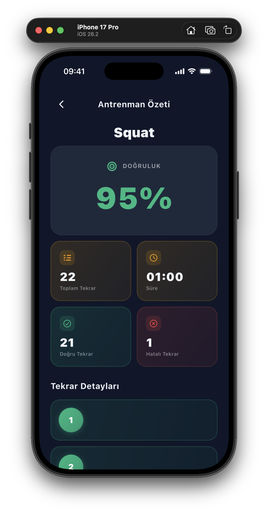
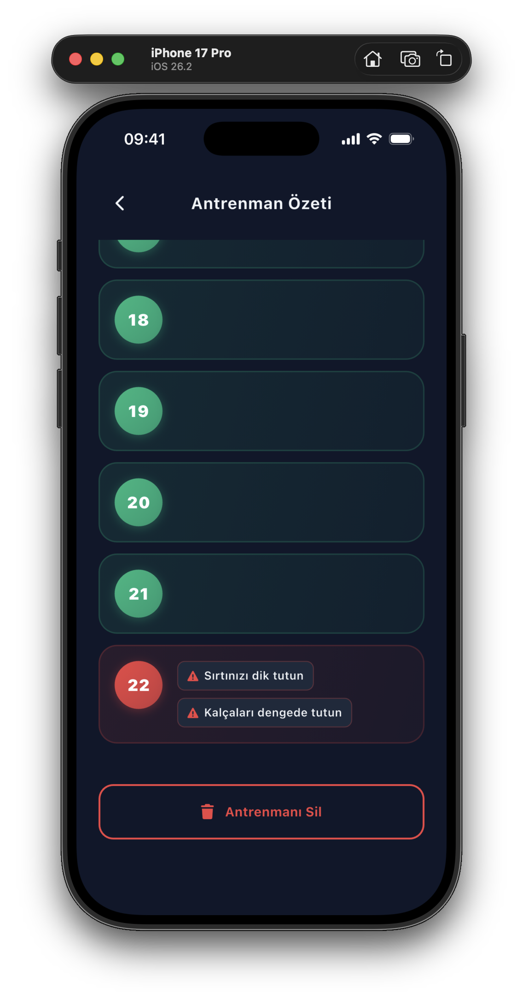
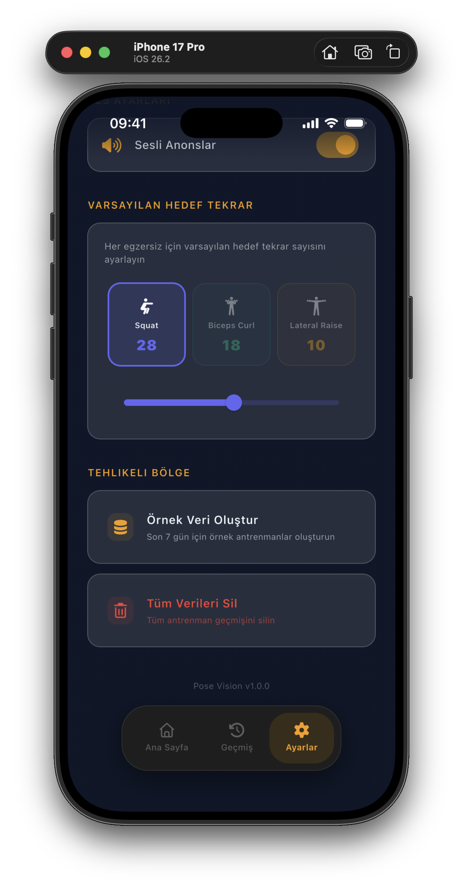

# Pose Vision: Mobil Egzersiz ve Hareket Analiz Sistemi

**Pose Vision**, Flutter ile geliştirilmiş, mobil cihaz kamerası üzerinden **gerçek zamanlı hareket analizi** yaparak egzersiz tekrarlarını sayan ve form hatalarını tespit edip anlık geri bildirim üreten çok platformlu (**iOS & Android**) bir uygulamadır. Proje, akademik çalışma kapsamında; mobilde görüntü işleme, mimari tasarım ve yerel veri yönetimi yaklaşımlarını birlikte ele alan bütüncül bir örnek olarak geliştirilmiştir.

- [Teslim Edilecekler](#teslim-edilecekler)
- [1. Proje Tanımı](#1-proje-tanımı)
- [2. Kullanılan Teknolojiler](#2-kullanılan-teknolojiler)
- [3. Sistem Mimarisi](#3-sistem-mimarisi)
  - [3.1. Katmanlar](#31-katmanlar)
  - [3.2. Proje Dizini](#32-proje-dizini)
- [4. Durum Yönetimi (BLoC)](#4-durum-yönetimi-bloc)
- [5. Veri Yönetimi](#5-veri-yönetimi)
- [6. Egzersiz ve Analiz Modülü](#6-egzersiz-ve-analiz-modülü)
- [7. Kullanıcı Arayüzü (UI/UX)](#7-kullanıcı-arayüzü-uiux)
- [8. Yerelleştirme (Localization)](#8-yerelleştirme-localization)
- [9. Ayarlar ve Kişiselleştirme](#9-ayarlar-ve-kişiselleştirme)
- [10. Ekran Görüntüleri](#10-ekran-görüntüleri)
- [11. Kurulum ve Çalıştırma](#11-kurulum-ve-çalıştırma)
- [12. Genel Değerlendirme ve Sonuç](#12-genel-değerlendirme-ve-sonuç)

## TESLİM EDİLECEKLER

### Proje Raporları
- 📄 **Analiz ve Tasarım Raporu**  
  [222132022 - Analiz Tasarım Raporu.pdf](raporlar/222132022%20-%20Analiz%20Tasarim%20Raporu.pdf)
- 📄 **Gerçekleştirim Raporu**  
  [222132022 - Gerçekleştirim Raporu.pdf](raporlar/222132022%20-%20Gerceklestirim%20Raporu.pdf)

### Derlenmiş Uygulama
- 📱 **Android - APK (Release)**  
  [pose_vision_release.apk](apps/pose_vision_release.apk)
- 📱 **iOS - IPA (Release)**  
  [pose_vision_release.ipa](apps/pose_vision_release.ipa)

## 1. Proje Tanımı

**Pose Vision**, bireylerin ev ortamında veya spor salonlarında profesyonel gözetim olmaksızın daha güvenli ve doğru egzersiz yapmasını desteklemeyi hedefler. Sistem, mobil cihazdan alınan kamera görüntüsü üzerinde **Google ML Kit Pose Detection** ile eklem noktalarını tespit eder; belirlenen biyomekanik eşiklere göre form doğruluğunu değerlendirir ve tekrar tamamlanma durumlarını yakalayarak kullanıcıya görsel/sesli geri bildirim verir. Amaç; yanlış form kaynaklı sakatlanma risklerini azaltmak ve performansı ölçülebilir verilerle takip edilebilir hale getirmektir.

## 2. Kullanılan Teknolojiler

Uygulama **Flutter** ve **Dart** ile geliştirilmiştir. Gerçek zamanlı poz tespiti için **Google ML Kit Pose Detection**, uygulama içi durum yönetimi için **BLoC** mimarisi kullanılmıştır. Kalıcılık için **Hive** (TypeAdapter tabanlı), çoklu dil desteği için **Easy Localization** entegre edilmiştir. Egzersiz sırasında tekrar sayımı ve geri bildirim deneyimini güçlendirmek amacıyla **Text-to-Speech (TTS)** altyapısından yararlanılmıştır.

## 3. Sistem Mimarisi

Proje; sürdürülebilirlik, test edilebilirlik ve ölçeklenebilirlik hedefleri doğrultusunda **Clean Architecture** yaklaşımıyla tasarlanmıştır. Bu sayede UI bağımlılıkları iş mantığından ayrıştırılmış; veri erişimi soyutlanmış ve katmanlar arası bağımlılıklar “Dependency Rule” doğrultusunda içeriden dışarıya doğru yönetilmiştir.

### 3.1. Katmanlar

**Presentation Layer**: UI ve kullanıcı etkileşimleri; BLoC üzerinden state yönetimi  
**Domain Layer**: İş mantığı; analyzer yapıları, entity’ler ve repository arayüzleri  
**Data Layer**: Yerel veri modelleri ve repository implementasyonları  
**Core Layer**: DI, servisler, sabitler ve yardımcı araçlar

### 3.2. Proje Dizini

```txt
lib
├── core
│   ├── constants
│   ├── di
│   ├── navigation
│   ├── services
│   └── utils
├── data
│   ├── models
│   └── repositories
├── domain
│   ├── analyzers
│   ├── entities
│   ├── helpers
│   └── repositories
├── main.dart
└── presentation
    ├── blocs
    ├── screens
    └── widgets
```

### 4. Durum Yönetimi (BLoC)

Uygulamada kamera akışı, analiz süreci, tekrar sayımı ve UI geri bildirimleri aynı anda yönetildiği için BLoC deseni tercih edilmiştir. Bu yapı, UI ile iş mantığını ayrıştırarak daha öngörülebilir ve test edilebilir bir mimari sağlar. UI tarafında BlocBuilder / BlocConsumer kullanılarak state değişimleri anlık olarak arayüze yansıtılır.

### 5. Veri Yönetimi

Uygulama, kullanıcı egzersiz geçmişini yerel cihazda saklar. Hive kullanımı, mobilde hızlı okuma/yazma ve düşük maliyetli kalıcılık avantajı sağlar. Egzersiz oturumları (WorkoutSession) ve tekrar detayları (RepRecord) ayrı kayıtlar olarak tutulur.

Veri erişimi Repository Pattern ile soyutlanmıştır. Domain katmanında IWorkoutRepository arayüzü yer alırken, data katmanı bu arayüzü WorkoutRepository ile implemente eder. Böylece veri kaynağı değişse bile (ör. ileride remote senkronizasyon) üst katmanların etkilenmemesi amaçlanmıştır.

### 6. Egzersiz ve Analiz Modülü

Analiz modülü, kamera görüntüsünden elde edilen pose landmark’larını kullanarak eklem açıları ve pozisyonlarını değerlendirir. Sistem, tekrar tamamlanmasını ve hatalı form durumlarını belirli eşikler üzerinden takip eder.

Desteklenen egzersizler:
Squat, Biceps Curl, Lateral Raise

Hareket sırasında:
- Pose skeleton overlay ile kullanıcıya anlık poz bilgisi gösterilir,
- Hatalı form durumunda fault mesajları üretilir,
- Tekrar tamamlandığında görsel geri bildirim ve isteğe bağlı sesli bildirim sağlanır.

### 7. Kullanıcı Arayüzü (UI/UX)

Arayüz; okunabilirlik, yüksek kontrast ve anlık geri bildirimi destekleyen modern bir tasarım yaklaşımıyla geliştirilmiştir. Kamera ekranında overlay çizimleri, tekrar feedback animasyonu ve hata vinyet efekti gibi unsurlar kullanıcıya hızlı ve anlaşılır geri bildirim sunar. Flutter widget yapısı sayesinde farklı ekran boyutlarına uyumlu (responsive/adaptive) bir kullanım hedeflenmiştir.

### 8. Yerelleştirme (Localization)

Uygulama Türkçe ve İngilizce dillerini destekler. Easy Localization ile tüm metinler çeviri dosyalarından yönetilir; kullanıcı ayarlardan dili değiştirdiğinde UI dinamik olarak güncellenir. Bu yapı, akademik sunumda “çoklu dil desteği” gereksinimini doğrudan karşılamaktadır.

### 9. Ayarlar ve Kişiselleştirme

Ayarlar ekranında:
- Tema seçimi (Light / Dark / System),
- Varsayılan hedef tekrar ayarları,
- Bazı kullanıcı tercihleri (örn. sesli bildirim) yönetilir.

Bu tercihler SharedPreferences üzerinden kalıcı hale getirilmiştir.

### 10. Ekran Görüntüleri

Aşağıda Pose Vision uygulamasının temel modüllerine ait ekran görüntüleri tablo düzeninde sunulmuştur.


| Ana Sayfa | Geçmiş | Ayarlar |
|---------|---------|---------|
|  |  |  |

---

| Egzersiz Kartları | Egzersiz Ayarları | Gerçek Zamanlı Analiz |
|------------------|------------------|----------------------|
|  |  |  |

---

| Geçmiş | Antrenman Özeti | Yanlış Form Detayı |
|---|---|---|
|  |  |  |

---

| Ayarlar (Dil/Tema/Ses) | Ayarlar (Hedef Tekrar/Verileri Sil) |
|--------|------------------|
|  |  |

### 11. Kurulum ve Çalıştırma

Projeyi çalıştırmak için Flutter kurulu olmalıdır.

```bash
flutter pub get
flutter run
```

iOS için gerekirse:

```bash
cd ios && pod install && cd ..
```

### 12. Genel Değerlendirme ve Sonuç

Pose Vision, mobil platformlarda gerçek zamanlı hareket analizinin; Clean Architecture, BLoC, Hive ve Localization gibi endüstri standardı yaklaşımlarla birleştirilerek uygulanabileceğini göstermiştir. Proje boyunca mimari ayrıştırma, state yönetimi, kalıcı veri tasarımı ve kamera/ML entegrasyonu pratik olarak gerçekleştirilmiştir.

Gelecekte; egzersiz çeşitliliğinin artırılması, analiz eşiklerinin kullanıcıya göre kalibre edilmesi, ilerleme grafikleri ve opsiyonel bulut senkronizasyon gibi geliştirmeler planlanabilir.